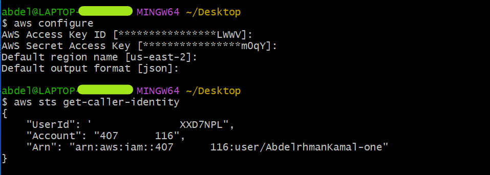

# Week 0 — Billing and Architecture

## Billing

### Budget and Cost Management

**Billing alarm** was found before budgets where they do the same thing but they don’t therefore It’s good practice to use both.Billing alarm via cloud watch will notify you through Amazon SNS ( Simple Notification Service ) topic that you choose. It’s a way to let you know if you have forgotten to stop or terminate an AWS services that pay you when you didn’t use them. It can integrate with your AWS services and has more fine grain controls. Also billing alerts must be enabled on your account before you can create a billing alarm.  
Creating a **budget** is also a way to be aware of what’s going on your pays. There are recommended pre-configuration templates like example the zero spend budget that notifies you once your spending exceeds 0.01 USD, take in your considerations that you’ve two free budget you can setup then you will pay also, budgets are easier to setup and have more modern additional features like forecasting.  
**Cost explorer** also is related which it's used to create custom reports monthly or daily level that analyse cost and usage data which by that you could forecast future costs and usage. It’s a good way to analyse your cost and usage data and create reports to share with your team or your manager.

as you can see in the image above, you can create a budget and set a threshold or more to notify you when you reach it.

No bucks can exist for publicity without safegaurd and security. You can use **IAM** ( Identity Access Management ) service that control who can access what, authentication and authorization to your AWS account. You can create a group and add users to it and then attach a policy to the group that will allow or deny access to the budget and cost management services. Securely manage identities and access to AWS services and resources, you can specify authorization and authentication which manage fine-grained permissions, who can access what. It have users, user groups, and roles

After creating the user he can access the account through the CLI with his credentials like the following commands

First command configure aws CLI with your credentials  
Second command to check that your configuration is correct and get your account ID  

 
  
## Architecture

For better architecture it's better to use the **AWS Well-Architected Framework** which is a way to help you build secure, high-performing, resilient, and efficient infrastructure for your applications. It provides a consistent approach for customers and partners to evaluate architectures, and implement designs that will scale over time. It’s a good way to build your architecture and make it more secure and efficient.

### AWS Well-Architected Framework

It helps you understand the pros and cons of decisions you make while building systems on AWS.The Framework is a set of SIX pillars that help you build a solid foundation for your cloud architecture. The six pillars are:  
1- **Operational Excellence**  

- Focuses on running and monitoring ( gain insights ) systems to deliver business value and to continually improve supporting processes and procedures.

2- **Security**  

- Protect data by encryption and by high integrity and confedentiality.

3- **Reliability**  

- IT systems should be designed to recover from infrastructure or service disruptions, dynamically acquire computing resources to meet demand, and mitigate disruptions such as misconfigurations or transient network issues.
  
4- **Performance Efficiency**  

- Using resources to meet business requirements, and maintain that performance as demand changes and technologies evolve.
  
5- **Cost Optimization**  

- Cost effective and efficient consumption model and expenditure.
- Achieving the best price-performance when running workloads on AWS.  
- It's about:  
  - Right sizing - matching resources to workload requirements.  
  - Optimizing over time - continually evaluating and refining the architecture.  
  - Economies of scale - leveraging the AWS global infrastructure.
  
6- **Sustainability**  

- It's newly added in 2021 which means using resources in a way that reduces the impact on the environment.
  

Link to the **My** [Crudder App architecture](https://lucid.app/lucidchart/544b9d05-54e8-42a4-9760-226ff0d80f88/edit?viewport_loc=-891%2C-659%2C2464%2C1244%2CbrHxuwCLES31&invitationId=inv_16e9ffbb-f196-4094-bd92-b9621e90d5a3)  
Link to **My Blog** [Abdelrhman Kamal](https://aws.amazon.com/well-architected-tool/)  
Link to the [AWS Well-Architected Tool](https://aws.amazon.com/well-architected-tool/)  
Link to the [AWS Well-Architected Framework](https://aws.amazon.com/architecture/well-architected/)  