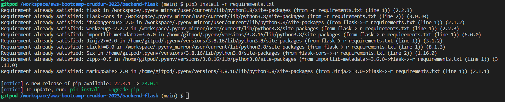
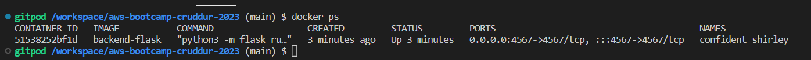
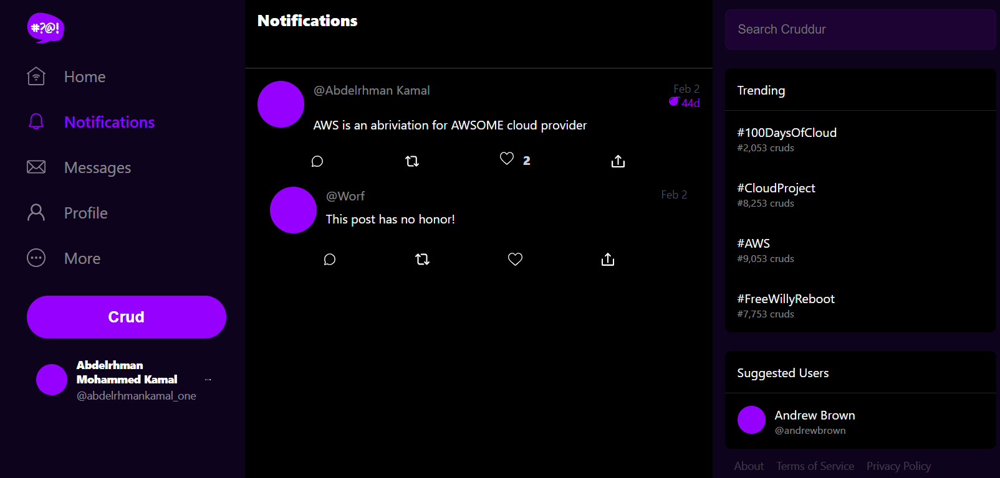
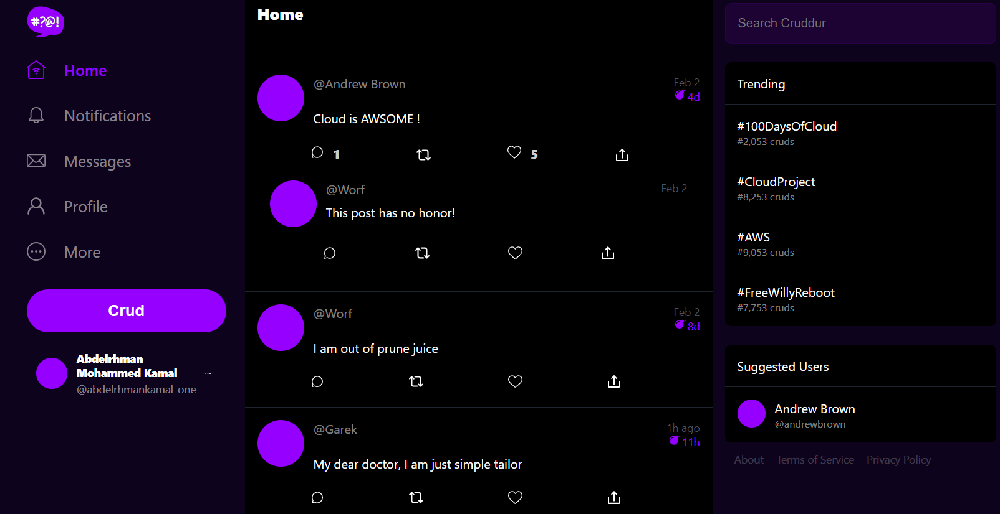
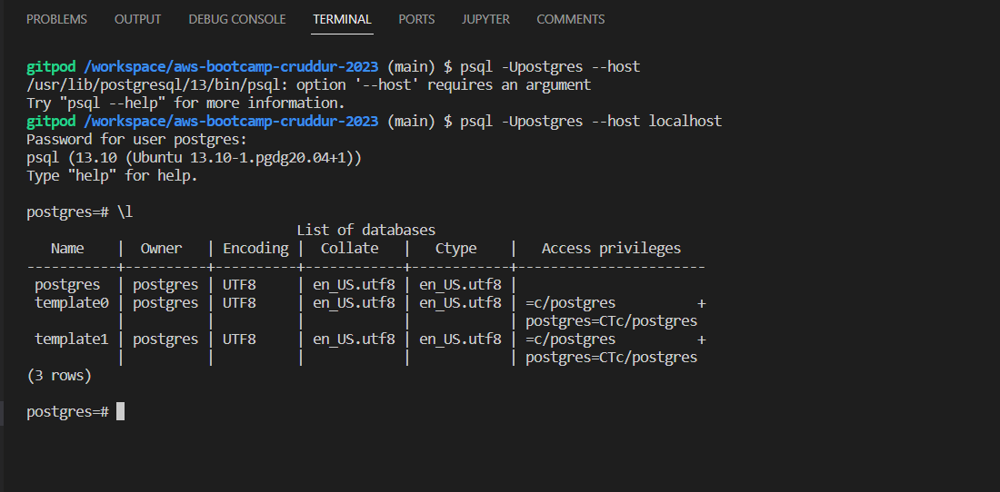

# Week 1 — App Containerization

## Docker  

Docker comprises two main components, which are the Docker Engine and the Docker Hub. The Docker Engine is the software that allows us to build, run, and share containers. The Docker Hub, which is also known as the Docker Registry, is a cloud-based repository where we can store and share our containers.  

**Docker client-server architecture :**  

- client : basically the device where you would install the Docker Engine and interact with it through the command line, it does the heavy lifting of building, running and sharing containers.  
- server : Docker daemon, where it would make use of the Docker Engine to provide a complete environment to execute and run applications. It's responsible for all container-related operations.

## Dockerfile

It's the standard text file that contains all the commands or instructions a user could call on the command line to assemble an image.  
**Scratch** is the base image, which essentially means that you're fulfilling the requirements of the Dockerfile where you're starting from.  

## Docker Compose

[docker-compose.yml](../docker-compose.yml) is created at the root of the project and used to allow us to run and orchestrate multiple containers at the same time.  
With Compose, you use the docker-compose.yml file to configure the application’s services. Then, the following command used to luanch up and start all the services from your configuration.  

```bash
docker-compose up -d --build 
```

Inside the container, we install the dependencies and run the application.  



The following command is used to see the status of the services and the containers that are running.  



## Backend and Frontend

The backend is a Flask application that is used to serve the data to the frontend. The backend is a REST API that is used to get the data from the database. The frontend is a React application that is used to display the data from the backend. The backend port is 4567 and the frontend port is 3000.  

Define an endpoint in the [openapi file](../backend-flask/openapi-3.0.yml) to get the notifications activities.

```yaml
/api/activities/notifications
```

Add a route to the backend to GET requests at the previous endpoint.

```python
@app.route("/api/activities/notifications", methods=['GET'])
def data_notifications():
  data = NotificationsActivities.run()
  return data, 200
```

Create a [notifications.py](../backend-flask/services/notifications_activities.py) file to return a list of notification activity data. Each notification activity object in the list contains various fields such as a unique identifier ("uuid"), the handle of the person who created the notification ("handle"), the message content ("message"), and others.

## Notification Page

Create notification page in the frontend.  
[notification.js](../frontend-react/src/pages/../../../frontend-react-js/src/pages/NotificationPage.js)  
[notification.css](../frontend-react/src/pages/NotificationPage.css)




### Postgresql


