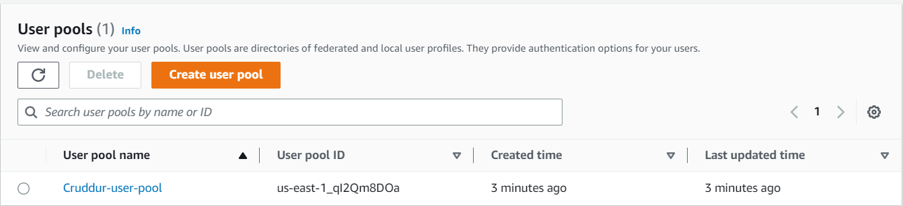
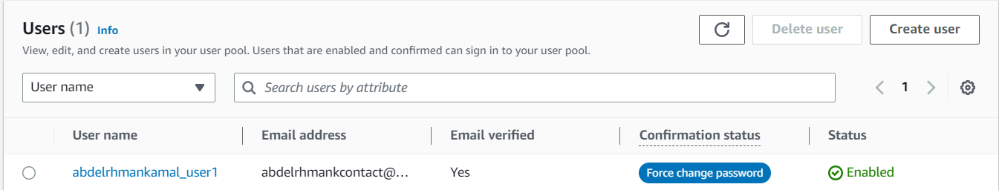
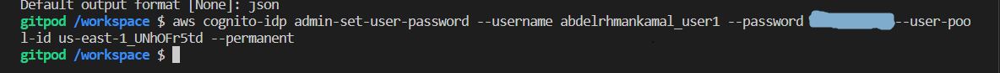
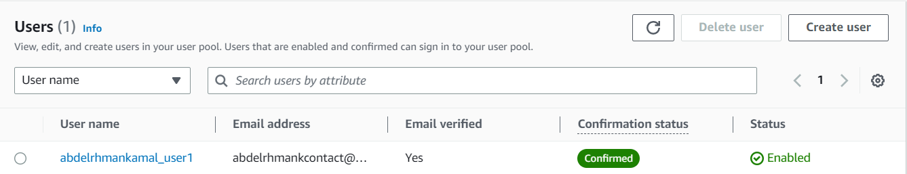

# Week 3 — Decentralized Authentication

Decentralized authentication is a way to authenticate users without relying on a central authority. This is a very important concept in the blockchain space, as it allows users to have control over their own data and identity. In this post, we will explore the different types of decentralized authentication and how they work.

## Amazon Cognito

Amazon Cognito is a service that lets you add user sign-up, sign-in, and access control to your apps quickly and easily which provides authentication, authorization, and user management for your web and mobile apps. Your users can sign in directly with a user name and password, or through a third party (social identity providers) such as Facebook, Amazon, Google or Apple. So, it scales to millions of users and supports thier sign-in process. It also provides support for user migration, so that you can migrate your users from an existing user directory to Amazon Cognito. Also, it lets you easily save and retrieve user preferences, such as language, theme, and other settings.  
**User pools** are user directories where users can sign up and sign in using their email address, phone number, or user name.  
**Identity pools ( Federated identities )** are identities that are linked to external identity providers, such as Facebook, Amazon, Google, or Apple using credentials from those providers through SAML or OpenID Connect.  

Created user pool

Created user in user pool

Command that uses the AWS Cognito Identity Provider (IDP) service to set a new password for a user in a user pool

- aws cognito-idp : This is the AWS CLI command for the Cognito Identity Provider service.
- admin-set-user-password : This is the subcommand used to set the password for a user.
- username : This is the username (abdelrhmankamal_user1) of the user whose password is being changed.
- password : This is the new password that will be set for the user. which this password must meets the password policy set for the user pool.
- user-pool-id : This is the ID of the user pool where the user exists.
- permanent: This is an optional parameter used to indicate whether the user's password should be permanent or temporary. If this parameter is not used, the password will be set to temporary by default.

