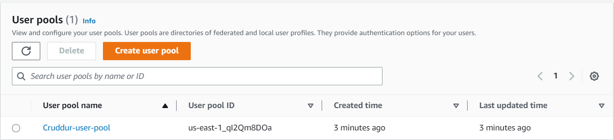

# Week 3 — Decentralized Authentication

Decentralized authentication is a way to authenticate users without relying on a central authority. This is a very important concept in the blockchain space, as it allows users to have control over their own data and identity. In this post, we will explore the different types of decentralized authentication and how they work.

## Amazon Cognito

Amazon Cognito is a service that lets you add user sign-up, sign-in, and access control to your apps quickly and easily which provides authentication, authorization, and user management for your web and mobile apps. Your users can sign in directly with a user name and password, or through a third party (social identity providers) such as Facebook, Amazon, Google or Apple. So, it scales to millions of users and supports thier sign-in process. It also provides support for user migration, so that you can migrate your users from an existing user directory to Amazon Cognito. Also, it lets you easily save and retrieve user preferences, such as language, theme, and other settings.  
**User pools** are user directories where users can sign up and sign in using their email address, phone number, or user name.  
**Identity pools ( Federated identities )** are identities that are linked to external identity providers, such as Facebook, Amazon, Google, or Apple using credentials from those providers through SAML or OpenID Connect.  

Created user pool and identity pool

## AWS Amplify

AWS Amplify is a JavaScript library for frontend and mobile developers building cloud-enabled applications. It provides a declarative and easy-to-use interface across different categories of cloud operations. It can be used with any JavaScript framework, and React Native.

